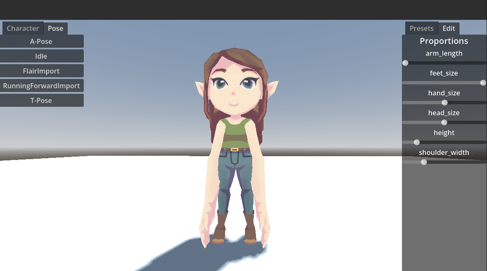

# Figura

<!-- TODO: Add Logo! -->

  

## Open-source Character Creation and Posing Tool Using Godot

**Figura** provides a flexible framework for building character creators using the **[Godot Engine](https://godotengine.org)**, enabling artists to design customizable characters in familiar tools like **[Blender](https://www.blender.org/)** while allowing developers to quickly integrate those characters into interactive applications. Rather than requiring months of specialized pipeline work, Figura automates much of the technical process required to connect 3D assets with in-engine character customization systems.

<!-- TODO: GHPages Deployment link! -->
A **[Playable Demo of Figura](#)** is available directly in the browser, allowing anyone to experiment with the character creator and explore its capabilities!

---

## Overview

Character creators are a powerful tool for creative expression. They allow players and artists to explore identity, experiment with design, and create characters across different artistic styles and worlds.

However, building these systems is technically complex. Figura aims to simplify this process by providing a framework that supports:

* **Modular character assets** (hair, clothing, accessories, etc.)
* **Mesh deformation via blendshapes**
* **Optional skeletal deformation**
* **Layered materials and color customization**
* **Automatic UI generation based on imported mesh data**

The project focuses on bridging the gap between **artist workflows** and **game development pipelines**, enabling small teams to divide work more effectively.

<!-- TODO: Character creator image -->

  

---

## Play the Demo

A live demo is hosted on GitHub Pages.

Try the latest build here:
<!-- TODO: GHPages Deployment link! -->
**[Play Figura in your browser](https://alf9310.github.io/Figura/)**

The demo allows you to:

* Create and customize characters
* Experiment with character sliders and modular assets
* Explore the core functionality of the framework

---

## Using the Character Creator in your own Game
<!-- TODO: Asset library upload! -->
The character creator framework was designed to be as easy to implement in external games as possible. Simply clone the repository and move into your project, or build off of the demo project template from the [Godot Asset Library](https://godotengine.org/asset-library/asset). Meshes included in the Character Creator are also Free and Open Source. Attribution is appreciated but not required. 

---

## Contributing

Figura is an open project that welcomes contributions from **artists, developers and playtesters**.

### Uploading 3D Models

<!-- TODO: Add image of Blender file structure -->

Models are split into groupings called **Style Kits**
**Style Kits** are comparable to **Image Makers** in [Picrew](https://picrew.me/en/), allowing artists to customize how users can modify their characters. They are comprised of modular 3D meshes. 

Examples of modular meshes:
* Hairstyles
* Clothing
* Accessories
* Body parts (arms, ears, etc.)

For additional customizability, these meshes can include:
* **Armature Deformations** stored as keyframes (height, limb proportions, etc.)
* **Mesh Deformations stored** as blendshapes (anything that doesn't change the character's armature: weight, muscluarity, etc.)
* **Texture Swapping** as multiple images per UV map (skin color, clothing pattern, etc.)

General guidelines:
* Models should be created in **Blender**
* Model armature should be created using the [Rigify Add-on](https://docs.blender.org/manual/en/2.81/addons/rigging/rigify.html) basic human armature
* Follow the project’s naming conventions for assets and blendshapes
* Maintain compatibility with the base armature if adjusting body porportions
* Keep topology animation-friendly when possible

<!-- TODO: Docs -->
Detailed asset guidelines will be documented in the `/docs` folder.

---

### Adding to the Source Code

Developers are welcome to improve or expand the Figura framework!

Typical contributions include:

* New customization systems
* UI improvements or themes
* Performance optimizations
* Import pipeline improvements
* Tooling for artists/developers

To contribute code:

1. Fork the repository
2. Create a feature branch
3. Implement your changes
4. Submit a pull request with a clear description

Please keep code well documented and follow existing project structure where possible.

---

### Playtesting

Playtesting is incredibly valuable.

You can help by:

* Trying the GitHub Pages demo
* Testing different character combinations
* Experimenting with sliders and modular assets
* Checking compatibility across browsers and devices

Feedback helps identify usability issues and prioritize improvements.

---

### Bug Reports

If you encounter a bug:

1. Check existing issues on GitHub
2. Open a new issue if one does not exist
3. Include the following information:

   * Description of the problem
   * Steps to reproduce the issue
   * Screenshots or recordings (if possible)
   * Browser/OS information

Clear bug reports make it much easier to diagnose problems.

---

## Community & Communication

The primary place for community discussion, collaboration, and support is the **Figura Discord server**.

There you can:

* Ask development questions
* Share assets or work-in-progress models
* Coordinate contributions
* Report issues or suggest features
* Participate in community playtesting

<!-- TODO: Discord Server Link -->
**Join the Discord:**
[Discord Invite Link]

---

## License

<!-- TODO: Link to license -->
Figura is completely free and open source under the [MIT license]
