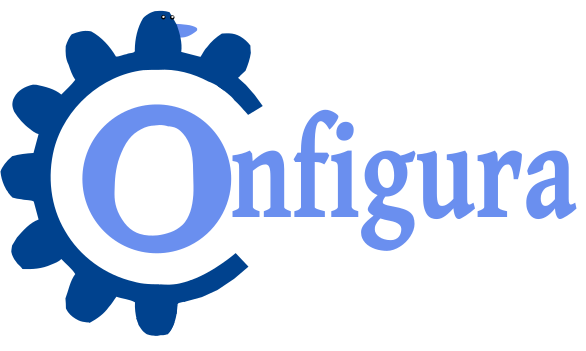
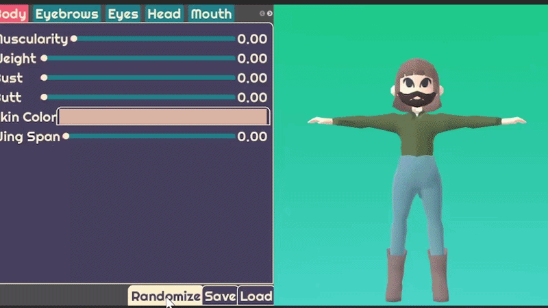
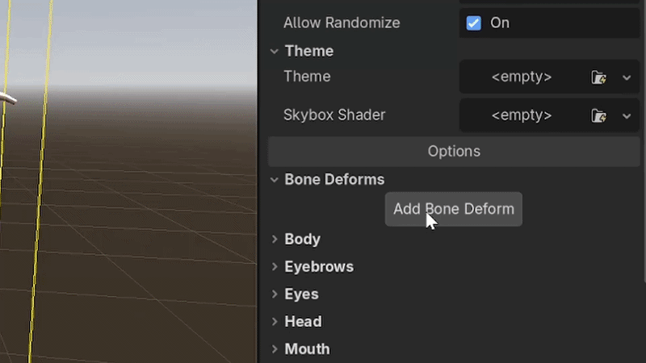
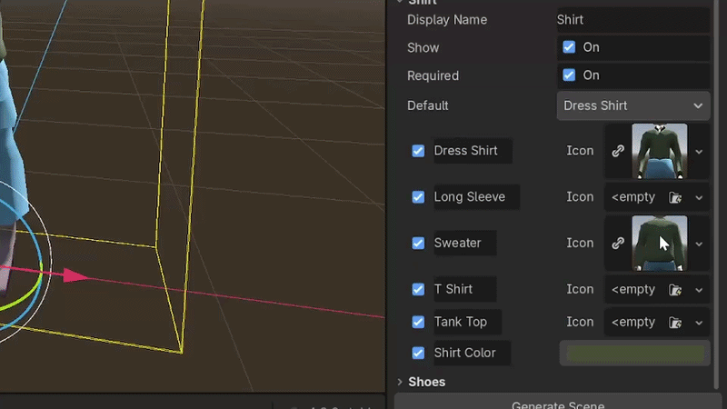

# Configura

  

## Open-source Character Creation and Posing Tool Using Godot

**Configura** provides a flexible framework for building character creators using the **[Godot Engine](https://godotengine.org)**, allowing developers to quickly integrate their 3D model into an interactive character creator. Our plugin automates much of the technical process required to connect 3D assets with in-engine character customization systems.

---

## Overview

  

Character creators are a powerful tool for creative expression. They allow players and artists to explore identity, experiment with design, and create characters across different artistic styles and worlds.

However, building these systems is technically complex. Configura aims to simplify this process by providing a framework that supports:

* **Modular character assets** (hair, clothing, accessories, etc.)
* **Mesh deformation via blendshapes**
* **Skeletal deformation**
* **Layered materials and color customization**
* **Automatic UI generation based on imported mesh data**

The project focuses on bridging the gap between **artist workflows** and **game development pipelines**, enabling small teams to divide work more effectively.

---

## You are in control

The Configura framework was built with developer/artist control in mind. Through our plugin dock, nearly every part of the final product is customizable to your game's need. By design, the framework is built with no constraints on model anatomy or level of detail, so long as it follows the naming conventions detailed within documentation. 

  
  

---
## Using the Character Creator in your own Game
<!-- TODO: Asset library upload! -->
The character creator framework was designed to be as easy to implement in external games as possible. Simply clone the repository and move into your project, or download it from the new [Godot Asset Store](https://godotengine.org/asset-library/asset).

Configura is an open project that welcomes contributions from **everyone!**

### Uploading 3D Models

<!-- TODO: Add image of Blender file structure -->
Models are split into user-defined groupings, allowing artists to customize how users can modify their characters. They are comprised of modular 3D meshes.

Examples of modular meshes:
* Hairstyles
* Clothing
* Accessories
* Body parts (arms, ears, etc.)

For additional customizability, these meshes can include:
* **Armature Deformations** created in Godot (anything that requires the skeleton of the mesh to deform: height, wingspan, bighead mode, etc.)
* **Mesh Deformations stored** as blendshapes (anything that doesn't change the character's armature: weight, muscluarity, etc.)
* **Atlas Texture** Swapping as multiple images per UV map (skin color, clothing pattern, etc.)

For information on how to use Configura, please refer to our [documentation](https://drive.google.com/drive/folders/1-l7AAGhuTMJdZu5t_6p1J7MVei-vuWLx?usp=drive_link).

---
### Documentation
* [Documentation Folder](https://drive.google.com/drive/folders/1-l7AAGhuTMJdZu5t_6p1J7MVei-vuWLx?usp=drive_link)
* For information on creating your 3D model(s), refer to [Artist Documentation](https://docs.google.com/document/d/1GYr33zAv79D-n_aid2mKaFaGEvylca8yKrAhH9oYE2c/edit?usp=sharing)
* For information on uploading your 3D model(s) and creating the character creator scene, refer to [Developer Documentation](https://docs.google.com/document/d/18e3JenWjVS0cHOxaPleWwfa-QKHvBhy-FnsVBV9CWu4/edit?usp=sharing)
* For a more detailed description of under-the-hood scripts, refer to [Internal Documentation](https://docs.google.com/document/d/1iWOP9pb7c7e-iOMeYIoo6CUO8fcMWdDgYTMIAMEr2e8/edit?usp=sharing)

---

### Adding to the Source Code

Developers are welcome to improve or expand Configura!

Typical contributions include:

* New customization systems
* UI improvements or themes
* Performance optimizations
* Import pipeline improvements
* Tooling for artists/developers

To contribute code:

1. Fork the repository
2. Create a feature branch
3. Implement your changes
4. Submit a pull request with a clear description

Please keep code well-documented and follow existing project structure where possible.

---

### Bug Reports

If you encounter a bug:

1. Check existing issues on GitHub
2. Open a new issue if one does not exist
3. Include the following information:

   * Description of the problem
   * Steps to reproduce the issue
   * Screenshots or recordings (if possible)

Clear bug reports make it much easier to diagnose problems.

---

## Community & Communication

The primary place for community discussion, collaboration, and support is the **Configura Discord server**.

There you can:

* Ask development questions
* Share assets or work-in-progress models
* Coordinate contributions
* Report issues or suggest features
* Participate in the community

<!-- TODO: Discord Server Link -->
**Join the Discord:**(https://discord.gg/jhwYxcMBab)

---

## License

<!-- TODO: Link to license -->
Configura is completely free and open source under the [MIT license]
